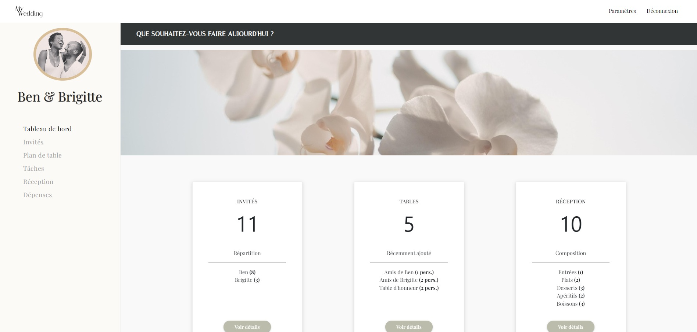

    <h1>
        
    </h1>
    <h4><b>Carnet de bord de mariage</b></h4>
    <h4>
        <a href="#about">À propose`</a>
        •
        <a href="#links">Liens</a>
        •
        <a href="#built-with">Technos</a>
        •
        <a href="#architecture">Architecture projet</a>
        •
        <a href="#contact">Crédits</a>
    </h4>

 
    

## Sommaire

- [Sommaire](#sommaire)
- [À propos](#à-propos)
- [Présentation et documents](#présentation-et-documents)
- [Technos](#technos)
- [Architecture projet](#architecture-projet)
- [Crédits](#crédits)

## À propos

 
 Le projet se présente sous forme de carnet de bord dédié à la préparation de mariage. Il comprend plusieurs sections telles que la liste d'invités, les plans de tables, le menu de réception, la liste de tâches ainsi qu'un tableau de dépenses.

## Présentation et documents

Le projet ayant été pensé en 2019, on peut observer l'évolution du site au travers des diagrammes, maquettes et autres supports à travers cette présentation:

✐ **Slideshow**: https://www.figma.com/file/hbRf87X3z8Y3jWPT0HzgBg/Presentation-finale---My-Wedding?type=design&node-id=0%3A1&mode=design&t=5WIeQ7nySbLKlbz5-1 

## Technos

Frontend
* 
* 
* 

Backend/Database
* 
* 
* 

Hosting
* 
* 

## Architecture projet

* Types: data types
* Components: reusable components
* Pages: pages layouts and their components
* Services: requêtes serveur
* Utils: custom hooks and other reusable functions
* Helpers: fonctions réutilisables
* Hooks: custom hooks
* Protected routes: composant d'authentification
* Pages: toutes les pages du site
* Img: images assets

## Crédits

Diane M.

